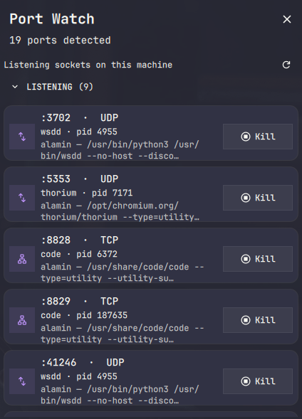

# Port Watch for DankMaterialShell

A native DMS port of [Rizmi/omarchy-portwatch-squre](https://github.com/Rizmi/omarchy-portwatch-squre).

## Features

- Single Port Watch icon in DankBar.
- Shows TCP/UDP listening ports.
- Shows process name, PID, working directory and command where available.
- Separates headless listening processes, GUI apps and ports whose owning PID cannot be read.
- Two-click **Kill / Confirm** action with a 5-second confirmation window.
- Verifies `/proc/<pid>/stat` start time before sending `SIGTERM`, reducing the risk of killing a recycled PID.
- Refreshes every 3 seconds only while the popout is visible.
- Right-click the bar icon to refresh immediately.
- No sudo and no network calls.

# Screenshots
<p align="center">
  
</p>

## Requirements

- DankMaterialShell >= 1.5.0
- Hyprland / `hyprctl`
- `ss` from `iproute2`
- `bash`

Fedora:

```bash
sudo dnf install iproute
```

## Installation
```bash
  dms plugins install portWatch
```

## Install locally

Copy this whole folder into:

```text
~/.config/DankMaterialShell/plugins/PortWatch/
```

For example:

```bash
mkdir -p ~/.config/DankMaterialShell/plugins
cp -r dms-portwatch ~/.config/DankMaterialShell/plugins/PortWatch
dms restart
```

Then open:

**DMS Settings → Plugins → Scan for Plugins → enable Port Watch**

After that, add **Port Watch** to the desired DankBar section.

## Notes

Non-root users cannot always see the process information for sockets owned by root or another user. Those ports still appear in the **SYSTEM** section when `ss` exposes the socket but not its PID.

The plugin deliberately sends `SIGTERM`, not `SIGKILL`.

## Attribution

Original Omarchy plugin: Rizmi / Omarchy Community.

https://github.com/Rizmi/omarchy-portwatch-squre

This port retains the original MIT license and adapts the scanner/safe-kill behavior to DMS's `PluginComponent`, DankBar pills and Material-themed plugin popout.


## 1.0.0

- Keep the Kill/Confirm target stable across automatic list refreshes.
- Keep the action button at a fixed width so it does not move between clicks.
- Prevent the surrounding Flickable from stealing Kill/Confirm clicks.
